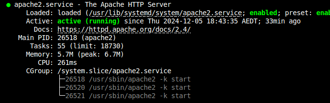
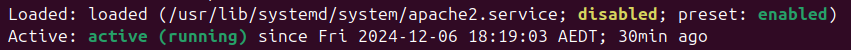
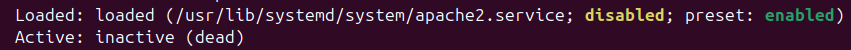

## Basic Linux Commands

### NAVIGATING THE FILE SYSTEM
Note : Directory is same as Folder
       man ls will give all options related to that command(here its ls)
       clear to clear the screen

1. `pwd` - Print Working Directory
	outputs which is the current directory.
2. `ls` - list storage
	
   `ls /`   File system at the beginning of the hard drive.

   `ls -l`/ Long listing

	
3. `cd` - Change directory
	`cd ..` - goes one level up(To the previous directory)
	`cd directory/` - Goes to the respective directory

### BASIC FILE EDITING

4. `touch` - creates a file
	`touch test.txt` - creates a text file called 'test'.

5. `nano` - opens a text editor

6. `which` - checks if command is installed.

### MOVING AND RENAMING FILES
 
7. `cp` - copy
	 `cp test2.txt newfile.txt` - copy everything from test2.txt to newfile.txt after creating newfile.txt

8. `cat` - to display the file

9. $diff - `diff file1 file2`: difference between two files

10. $rm - remove/delete 

11. $mv - move
	`mv file1 file2` - move file1 to file2

### PERMISSIONS

12. Permission string - 1 2 3 4 5 6 7 8 9 10
	bit 1 - Directory or file
	bit 2,3,4 - user (owner of the file or directory)
	bit 5,6,7 - Group
	bit 8,9,10 - Other(aka "world")
	eg, drwxr-xr-x 3 joe-savio joe-savio 4096 Oct 24 21:41 Desktop
	r - read(able to see contents), 
	w - write(able to change contents),
	x - execute(able to enter into directory)

### CHECKING RESOURCE USAGE

13. $free

14. $free -m

15. $df - Disk free

16. df -h : h- human readable

17. df -i : i - inodes, files

18. htop

19. uptime - load average: over the last minute, over the last 5 minutes, over the last 15 minutes.

### PACKAGE MANAGEMENT

20. sudo apt update

21. apt search

22. sudo apt install apache2

23. sudo apt remove apache2

24. sudo apt upgrade

25. sudo apt dist-upgrade

### MANAGING SYSTEMD UNITS

26. systemctl status "name of unit" 
[]

27. sudo systemctl disable/enable "name of unit"
[]

28. sudo systemctl stop/start "name of unit" 
[]

29. In Linux, units are a core concept of the `systemd` system and service manager. A unit represents a single object that `systemd` can manage, such as a service, a socket, a device, a mount point, or even a target for system states. Units are defined using unit files, which describe their configuration and behavior.

  Types of Units in Linux

There are several types of units, each with a specific purpose:

| Unit Type    | File Extension | Description                                                                 |
|-------------------|--------------------|---------------------------------------------------------------------------------|
| Service       | `.service`         | Represents a service (e.g., a daemon like `nginx` or `ssh`).                   |
| Socket        | `.socket`          | Represents a socket for inter-process communication (IPC).                     |
| Target        | `.target`          | Represents a group of units (used to manage system states like `multi-user`).  |
| Mount         | `.mount`           | Represents a mount point in the filesystem.                                    |
| Device        | `.device`          | Represents a device recognized by the kernel.                                  |
| Timer         | `.timer`           | Represents a timer for scheduling tasks (replaces `cron` in some cases).       |
| Swap          | `.swap`            | Represents a swap file or partition.                                           |
| Path          | `.path`            | Represents a path in the filesystem to monitor for changes.                    |
| Slice         | `.slice`           | Represents a group of units for resource management.                           |
| Scope         | `.scope`           | Represents external processes started by something other than `systemd`.       |

  Common Unit Examples

1. Service Unit (`.service`):
   Manages services like `ssh` or `nginx`.
   - Example: `/lib/systemd/system/ssh.service`

2. Socket Unit (`.socket`):
   Manages sockets for services that use socket-based activation.
   - Example: `/lib/systemd/system/cups.socket`

3. Target Unit (`.target`):
   Represents system states or milestones.
   - Example: `/lib/systemd/system/multi-user.target`

4. Timer Unit (`.timer`):
   Schedules tasks based on time or intervals.
   - Example: `/etc/systemd/system/backup.timer`

### MANAGING USERS
30. cat /etc/passwd

31.sudo cat/etc/shadow

32. cat /etc/group

33.groups

34.sudo adduser "name of the new user" # Adds new user

35. su - "new user name" # to got to the new user

36. sudo su - "new user name"

37. sudo userdel -r "new user name" # This will delete the user and the files !! USE CAREFULLY"
Note: ignore this message, "userdel: andor mail spool (/var/mail/andor) not found"

38. sudo groupadd "name of the new group" #To add a new group

39. sudo usermod -aG "name of the new group" user-name # will add the user to the new group

40. sudo gpasswd -d user-name "name of the group" # Removes the user from the group

41. sudo groupdel "name of group to be deleted" # to delete a group

